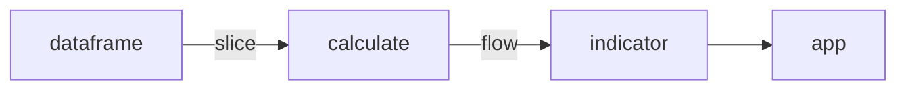
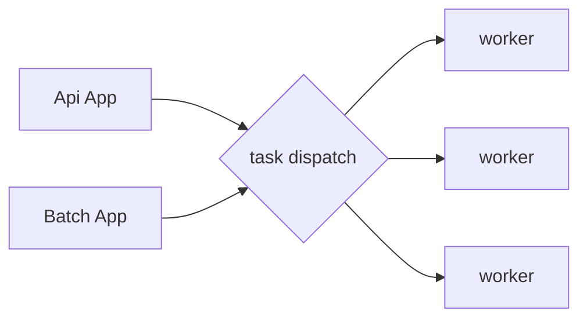

## 量化指标平台架构

资产管理行业会购买很多金融资产，然后通过构建组合进行投资。各种资产构建的组合，采用简单或者复杂的数学指标对组合进行计算评估。评估组合的风险、业绩归因，然后进行组合优化。

在这个过程中，针对组合的指标计算是非常重要的。量化指标平台就是为了应对多变的指标计算设计的，针对主要大类资产，提供行业通用的指标计算方法。同时提供自定义指标的功能，融合分布式计算能力，提供实时和批处理结合的指标加工方式。并且针对数据源进行业务层的划分，方便指标的开发。总结来说，就是提供一个具有强大计算和动态指标构建能力的平台

### 指标的抽象

指标是对一段时间的资产的量价数值进行一定的计算，得出的一个或者一组数值。再抽象一下，就是从一组数值 ，经过一系列的计算，得出另外一个一组数值。(一个数值也可以理解为只有一个值的数组)

```python
def f(array_data, other_arg):  
  #some compute
  return array
```

这是最基础的计算单元。在计算里面会使用 numpy 来做计算，例如 prod、mean、dot、sum 等操作。array_data 是输入的 float 数组， other_arg，包含了一些其他参数，例如基准数值、权重、bp 偏移量、计息方式等等

指标除了基础计算以外，还包含业务上的信息。包括资产组合代码、起始时间。所以指标的函数定义如下：

```python
def daily_return(data, cmbno, start_day, end_day):
  """日收益率计算

  参数:
  	data(dataframe):pandas dataframe 格式的原始数据
  	cmbno(str):资产编号，可以是个券、组合或者其他资产代码
  	start_day(timestamp)：开始时间
  	end_day(timestamp): 结束时间

  """

```


### 数据的处理

从基本的量价数据，经过一定的处理，包括 map 、shuffle 、reduce 的过程，然后提供到指标可以使用的 array 。这个过程，主要是通过 pandas 来完成


### 业务逻辑输出

基于基础数据，生成指标，然后把指标按照业务的定义做多维度的汇集，输出成一个业务应用。这是指标计算和业务系统结合的过程。

结合以上的过程，指标生成应用的流程如下：



dataframe 是原始数据集，经过 slice 的操作，提供给 calculate 纯函数做计算。然后经过 flow 的拼装成为 indicator

app 是最终应用，是由 indicator 加上一些业务上其他的数据或者操作形成的应用。主要是一些多维度的过滤查询



有两种类型的 APP，一种是通过 API 实时调用返回；一种是定时或者触发式批处理。对于后台计算平台来说，这两种都是一次计算任务 (task) 的分配和计算结果返回
